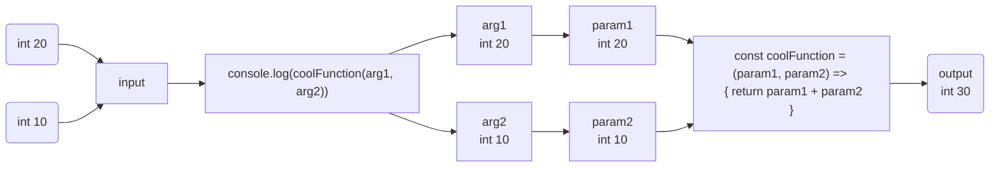
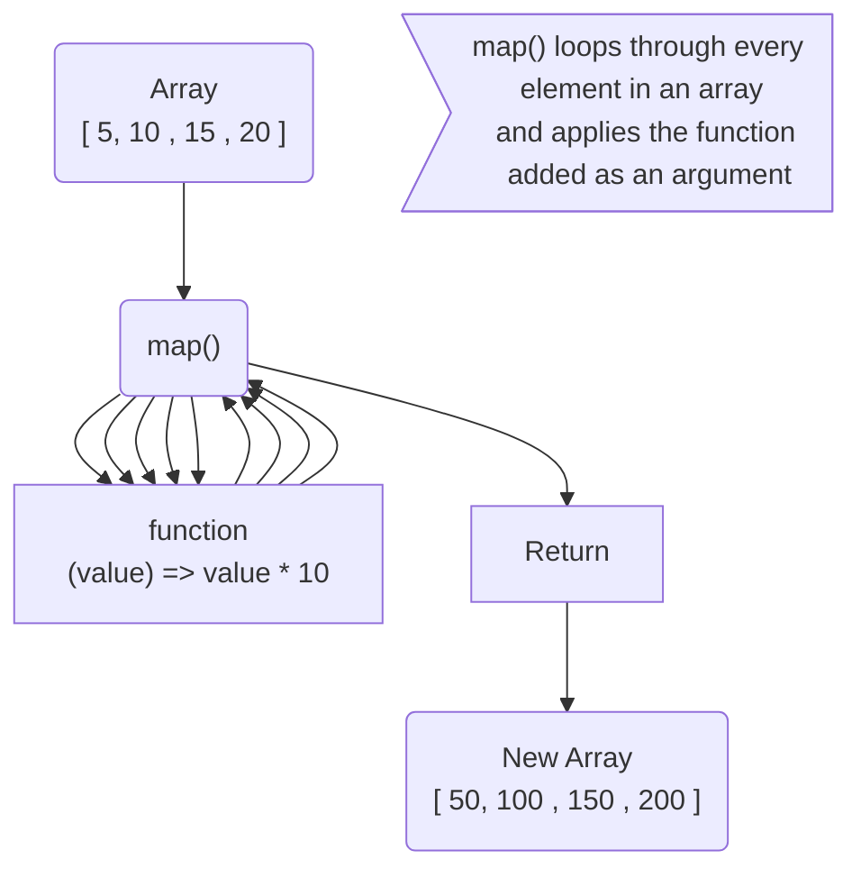
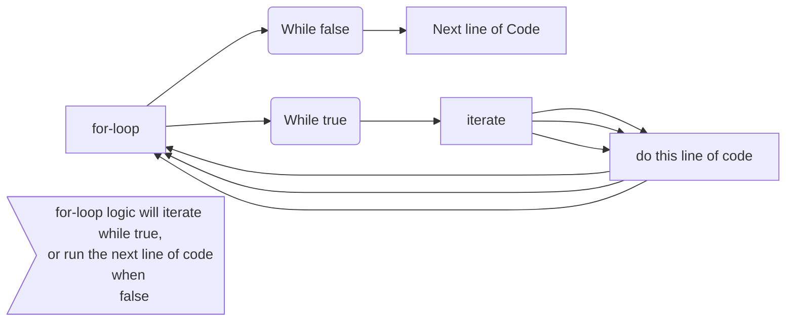

# ASSESSMENT 2: Interview Practice Questions

Answer the following questions.

First, without external resources. Challenge yourself to answer from memory as 
if you were in a job interview.

Then, research the question to expand on your answer. Even if you feel you have 
answered the question completely, there is always something more to learn. 
Write your researched answer in your OWN WORDS.

---
<!-- ----------------------------------------------------------------------- -->
## 1. What is the difference between a parameter and an argument?

### Your answer: 
* A parameter is a descriptive placeholder and reference for input 
data to be passed through in a function or class when its declared. 
* An argument is the data that is being passed to an invoked function or class,
and coresponds with the associated parameters declared functions or classes. 

### example of parameters:
```javascript
                      // Parameters
 const coolFunction = (param1, param2) => {
    return param1 + param2;
};
```

### example of arguments:
```javascript
                          // Arguments
 console.log(coolFunction(arg1, arg2));
```

 <!-- -----------------visual diagram -------------------------------------- -->
## <p align="center"> Diagram of arguments being passed to parameters in function</p>


### Researched answer:
According to https://www.w3schools.com/js/js_function_parameters.asp, a
parameter is the name listed in the function definition, and an argument is the 
value passed to and received by the functionn

---
<!-- ----------------------------------------------------------------------- -->
## 2. The JavaScript built in method .map() takes predefined parameters. What are 
they? Which are required and which are optional?

Your answer: Map() takes in three predefined parameters which correlate with 
element, index, and array in that order. The element parameter is required, 
whereas index and array are optional.

Researched answer:
According to MDN WebDocs, callbackFn is executed with every element on the array
and takes in the arguments:
* element
* index
* array
* thisArg (which is optional)

---
<!-- ----------------------------------------------------------------------- -->
## 3. What is the difference between map and filter?

### Your answer: 
* map() affects every element in an array
  * You would use map() to invite everyone in your office to your house party..

* filter() effects only the elements that pass a given conditional test
  * You would use filter() to invite everyone but Dwight..

<!-- -----------------visual diagram -------------------------------------- -->
## <p align="center"> Diagram of map() and filter()</p>


### Researched answer:
According to MDN Webdocs: 
* The map() method creates a new array based on the 
output of the function provided inside map() on every element of the array.
* filter() creates a shallow copy af an array based elements that pass whatever 
  test may be implemenmted by a function inside the filter() method.

---
<!-- ----------------------------------------------------------------------- -->
## 4. What is iteration?

### Your answer: 
* what is iteration?
* what is iteration?
* what is iteration?

iteration is the process of repeating a sequence of events a certain number of 
times depending on if a condition is met.

``` javascript
// while dishes are dirty 
// continue to stack the dishwasher

while(dishesDirty) {
  stackDishWasher()
}

```
<!-- -----------------visual diagram -------------------------------------- -->
## <p align="center"> for-loop / iteration process</p>


### Researched answer:
according to Dictionary.com: iteration is the repitition of a computational 
procedure that gets applied to the result of it's previous procedure.

---
<!-- ----------------------------------------------------------------------- -->
## 5. What is the difference between a class and an object?

### Your answer: 
* A class is the blueprint for an object.
  * You can only have one class (example: only one Cat class)
* An object is created from the "DNA" of class. 
  * You can have many objects from one class

### Researched answer:
According to: 
https://www.ncl.ucar.edu/Document/HLUs/User_Guide/classes/classoview.shtml#:~:text=A%20class%20defines%20object%20properties,are%20defined%20by%20default%20settings.

 * A class defines what an object's properties and behaviors will be.   
 * An object is an instrance of a class. 
---
<!-- ----------------------------------------------------------------------- -->
## 6. STRETCH: What is hoisting in JavaScript?

### Your answer: 
Hoisting is the ability to call a function or method before it has 
been declared in code. invoking a function at the top of your code, but the 
function is declared at the bottom.

### Researched answer:
According to: https://www.w3schools.com/js/js_hoisting.asp
* Hoisting is when you move declarations to the top of the code to be interpreted.
* With hoisting a variable can be used before it has been declared.

---
<!-- ----------------------------------------------------------------------- -->
## Looking Ahead: Terms for Next Week

### Research and define the following terms to the best of your ability.

1. User stories: These are used to help define an application and guide 
   developers on features to add. 

2. Spread operator: this is a handy feature that allows you to do some 
   interesting things with array manipulation, and allows a parameter in a 
   function to accept an undetermined amount of inputs 
   
3. React: React is a JavaScript library that is popular due to it's unique 
   method of creating a virtual DOM, Component style paradigm, use of state,
   and active developer community.  
   
4. React props: These allow you to pass values from one react component to 
   another

5. DOM events: Events that happen in the Document Object Model.
   * having to look this up, so based on:
    https://www.w3schools.com/jsref/dom_obj_event.asp, DOM events allow
    JavaScript to associate different event handlers on elements in HTML.
